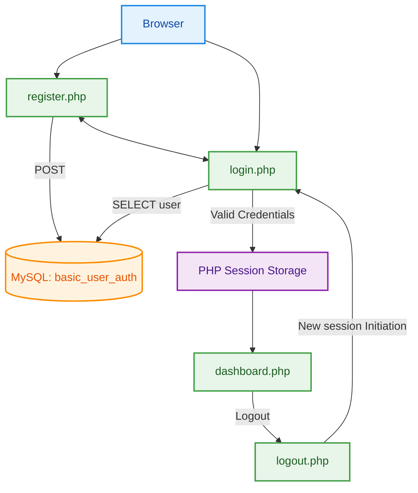

# Basic User Authentication System (PHP + MySQL + PDO)

## Overview

This project implements a session-based authentication system using:

- PHP 8
- MySQL
- PDO (PHP Data Objects)
- SHA-256 password hashing
- Native PHP sessions

The system provides user registration, login, protected dashboard access, and logout functionality.

---

## Project Structure

```
.
├── dashboard.php
├── db.php
├── demobase.sql
├── login.php
├── logout.php
├── phase1_changes.sql
├── register.php
└── README.md
```

---

## Database Design

### Database: `demobase`

### Table: `basic_user_auth`

```sql
CREATE TABLE basic_user_auth (
    id INT AUTO_INCREMENT PRIMARY KEY,
    user VARCHAR(100) NOT NULL UNIQUE,
    pass VARCHAR(255) NOT NULL,
    creation_time TIMESTAMP DEFAULT CURRENT_TIMESTAMP,
    role VARCHAR(20) DEFAULT 'user'
);
```

### Column Description

| Column | Type | Purpose |
|--------|------|----------|
| `id` | INT AUTO_INCREMENT | Unique identifier (primary key) |
| `user` | VARCHAR(100) UNIQUE | Username |
| `pass` | VARCHAR(255) | SHA-256 hashed password |
| `creation_time` | TIMESTAMP | Account creation time |
| `role` | VARCHAR(20) | Authorization role (`admin` or `user`) |

### Initial Data

```sql
INSERT INTO basic_user_auth(user, pass)
VALUES
('Shipman', SHA2('shipman@1278', 256)),
('Versatile', SHA2('vertyg#**9012', 256));
```

Role assignment:

```sql
ALTER TABLE basic_user_auth ADD COLUMN role VARCHAR(20) DEFAULT 'user';

UPDATE basic_user_auth
SET role = 'admin' WHERE user = 'Shipman';
```

---

## Authentication Flow



---

## File Responsibilities

### `db.php`

Establishes a PDO connection to MySQL.

```php
$pdo = new PDO($dsn, $dbUser, $dbPass);
$pdo->setAttribute(PDO::ATTR_ERRMODE, PDO::ERRMODE_EXCEPTION);
```

- Uses DSN with UTF-8 encoding.
- Enables exception-based error handling.
- Provides `$pdo` object to other scripts.

---

### `register.php`

Handles:

- Input validation
- Password hashing
- User insertion
- Duplicate handling
- Redirect to login

Key operations:

```php
$username = trim($_POST["username"]);
$password = $_POST["password"];
```

```php
$hash = hash('sha256', $password);
```

```php
$stmt = $pdo->prepare(
    "INSERT INTO basic_user_auth(user, pass)
     VALUES (:user, :pass)"
);
```

- Uses prepared statements.
- Hashes password using SHA-256.
- Redirects via `header("Location: login.php");`.

---

### `login.php`

Handles:

- POST validation
- User lookup
- Hash comparison
- Session initialization
- Redirect to dashboard

Password verification:

```php
if ($user && hash('sha256', $password) === $user['pass'])
```

Session hardening:

```php
session_regenerate_id(true);
```

Session variables set:

```php
$_SESSION['user_id']
$_SESSION['username']
$_SESSION['role']
```

---

### `dashboard.php`

Protected route.

Access control:

```php
if (!isset($_SESSION['user_id'])) {
    header("Location: login.php");
    exit;
}
```

Displays:

- Logged-in username
- Role
- Logout link

Uses `htmlspecialchars()` to prevent output injection.

---

### `logout.php`

Terminates session:

```php
$_SESSION = [];
session_destroy();
header("Location: login.php");
```

Clears session state and redirects to login.

---

## Session Management

- `session_start()` initializes session handling.
- Session variables store authenticated identity.
- `session_regenerate_id(true)` prevents session fixation.
- Protected pages verify session existence before rendering.

---

## Password Handling

Passwords are hashed using:

```php
hash('sha256', $password);
```

Database stores only hashed values.

Login compares hashed input with stored hash.

---

## PDO Usage

All database interactions use prepared statements:

```php
$stmt = $pdo->prepare("...");
$stmt->execute([...]);
```

This ensures:

- Parameter binding
- SQL injection resistance
- Exception-driven error handling

---

## Request Handling

All form processing is gated by:

```php
if ($_SERVER["REQUEST_METHOD"] === "POST")
```

This ensures:

- Logic executes only on POST submission.
- Direct GET access does not trigger database operations.

---

## Access Control Model

Authentication:
- Username + password verification.

Authorization:
- Role stored in `role` column.
- Session stores user role.
- Dashboard displays current role.

---

## System Characteristics

- Session-based authentication
- Server-side validation
- SHA-256 password hashing
- Unique username constraint
- Prepared statements via PDO
- Redirect-based navigation
- Role attribute stored per user
- Auto-increment primary key
