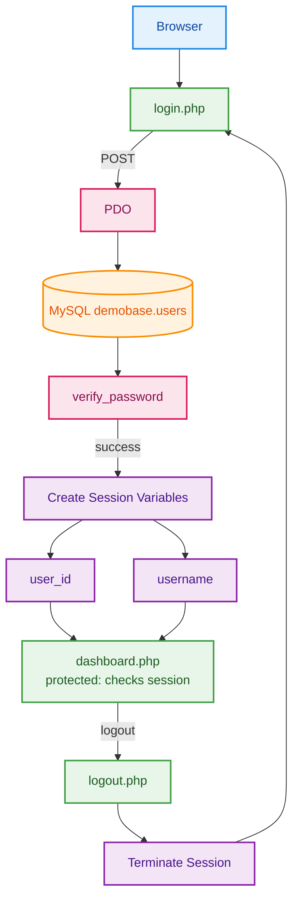

'''
Password Hashing Strategy (Demo Disclaimer)

This project uses SHA2() for hashing passwords inside MySQL:

SHA2(password, 256)
Why SHA2 Is Not Recommended for Production

SHA2 is a fast cryptographic hashing algorithm. While it is secure for data integrity verification, it is not suitable for password storage in real-world applications because:

It is computationally fast (vulnerable to brute-force attacks)

It does not include automatic salting

It does not provide adaptive work factors

It is vulnerable to rainbow table attacks

Modern authentication systems should use:

password_hash() in PHP (bcrypt or Argon2)

Adaptive hashing algorithms with built-in salting

Configurable cost factors

Why It Is Used Here

SHA2 is used in this project strictly for:

Demonstration purposes

Understanding authentication flow

Practicing PDO and session handling

Educational experimentation

This project is not intended for production deployment.
'''

'''

PHASE 1 — Complete Core Authentication Properly

Goal: Convert your demo into a clean, minimal, structured authentication system.

We will implement:

Registration

Server-side validation

Secure login flow

Session regeneration

Basic architecture cleanup
'''

