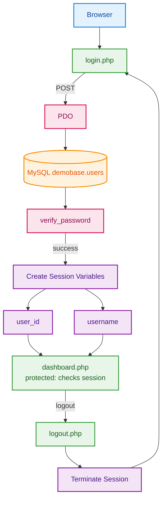

```mermaid
flowchart TD

    Browser[Browser]

    login[login.php]
    PDO[PDO]
    DB[(MySQL demobase.users)]
    verify[verify_password]

    session[Create Session Variables]
    uid[user_id]
    uname[username]

    dash["dashboard.php<br/>protected: checks session"]

    logout[logout.php]
    terminate[Terminate Session]


    Browser --> login

    login -->|POST| PDO
    PDO --> DB
    DB --> verify

    verify -->|success| session

    session --> uid
    session --> uname

    uid --> dash
    uname --> dash

    dash -->|logout| logout
    logout --> terminate
    terminate --> login


    %% Color definitions
    classDef client fill:#E3F2FD,stroke:#1E88E5,stroke-width:2px,color:#0D47A1;
    classDef php fill:#E8F5E9,stroke:#43A047,stroke-width:2px,color:#1B5E20;
    classDef database fill:#FFF3E0,stroke:#FB8C00,stroke-width:2px,color:#E65100;
    classDef security fill:#FCE4EC,stroke:#D81B60,stroke-width:2px,color:#880E4F;
    classDef session fill:#F3E5F5,stroke:#8E24AA,stroke-width:2px,color:#4A148C;


    %% Apply colors
    class Browser client;

    class login,dash,logout php;

    class PDO,verify security;

    class DB database;

    class session,uid,uname,terminate session;
```